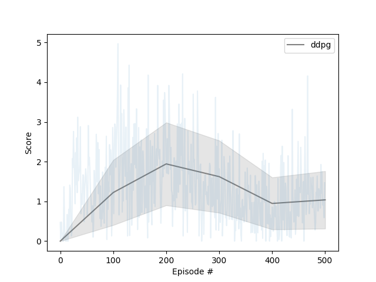

# deep-rl-udacity
Code for the Navigation project.

## Environment
The Unity Banana environment has contains one agent that navigates a large environment with bananas. The goal is to collect as many yellow bananas, while avoiding the blue ones. At each time step, it has four actions at its disposal:

0 - walk forward
1 - walk backward
2 - turn left
3 - turn right

The state space has 37 dimensions and contains the agent's velocity, along with ray-based perception of objects around agent's forward direction. The 35 dimensions of ray perception are broken down as: 7 rays projecting from the agent at the following angles (and returned back in the same order): [20, 90, 160, 45, 135, 70, 110] where 90 is directly in front of the agent. Each ray is 5 dimensional and it projected onto the scene. If it encounters one of four detectable objects (i.e. yellow banana, wall, blue banana, agent), the value at that position in the array is set to 1. Finally there is a distance measure which is a fraction of the ray length. Each ray is [Yellow Banana, Wall, Blue Banana, Agent, Distance]. 

A reward of +1 is provided for collecting a yellow banana, and a reward of -1 is provided for collecting a blue banana. If an average score of +13 over 100 consecutive episodes is reached, the game is solved! 

## Run the code
If you want to train the models, you may use the [train_unity.py](train_unity.py) file or the [Report.ipynb](Report.ipynb) notebook. If you want to evaluate the models, load a the weights of a trained model from the [stored_weights](stored_weights) folder. 

The folders are organized as follows:
- [models](models) contains the dqn network.
- [training](training) contains the dqn algorithms for both the unity and lunar-gym environment.
- [stored_weights](stored_weights) contains the trained models. 

There are 4 models benchmarked, and the training loss is given below: 

## Dependancies
The code is written in Python and Pytorch with the following dependancies [requirements.txt](requirements.txt)

You need only select the environment that matches your operating system:
    - Linux: [click here](https://s3-us-west-1.amazonaws.com/udacity-drlnd/P1/Banana/Banana_Linux.zip)
    - Mac OSX: [click here](https://s3-us-west-1.amazonaws.com/udacity-drlnd/P1/Banana/Banana.app.zip)
    - Windows (32-bit): [click here](https://s3-us-west-1.amazonaws.com/udacity-drlnd/P1/Banana/Banana_Windows_x86.zip)
    - Windows (64-bit): [click here](https://s3-us-west-1.amazonaws.com/udacity-drlnd/P1/Banana/Banana_Windows_x86_64.zip)

Which you need to unzip and put in this repository.

