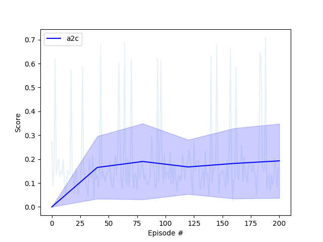
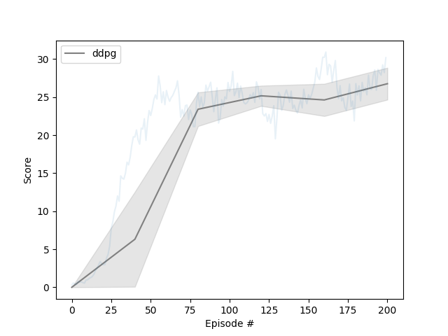

# deep-rl-udacity
Code for the Navigation project.
The environment are 20 robots trying to reach a target and the algorithms implemented for solving the environment are A2C and DDPG. 

## Environment
In this environment, a double-jointed arm can move to target locations. A reward of +0.1 is provided for each step that the agent's hand is in the goal location. The goal of the agent is to maintain its position at the target location for as many time steps as possible.

The observation space consists of 33 variables corresponding to position, rotation, velocity, and angular velocities of the arm. Each action is a vector with four numbers, corresponding to torque applicable to two joints. Every entry in the action vector should be a number between -1 and 1.


The environment is considered solved when the average score over the previous 100 episodes is at least +30 when averaging the returns across all agents in the environment.

## Run the code
If you want to train the models, you may use the [train_unity.py](train_unity.py) file or the [Continuous.ipynb](Continuous.ipynb) notebook. If you want to evaluate the models, load a the weights of a trained model from the [stored_weights](stored_weights) folder. 

The folders are organized as follows:
- [models](models) contains the dqn network.
- [training](training) contains the dqn algorithms for both the unity and lunar-gym environment.
- [stored_weights](stored_weights) contains the trained models. 

There are models benchmarked, and the training loss is given below: 



Please read the [Report.ipynb](Report.ipynb) to see how the project is solved. 

## Dependancies
The code is written in Python and Pytorch with the following dependancies [requirements.txt](requirements.txt)

If you want to install the required Python packages use:
```
pip install -r requirements.txt
```

If you want to install the project with pip, use:
```
pip install -e .
```

You need only select the environment that matches your operating system:
        - Linux: [click here](https://s3-us-west-1.amazonaws.com/udacity-drlnd/P2/Reacher/Reacher_Linux.zip)
        - Mac OSX: [click here](https://s3-us-west-1.amazonaws.com/udacity-drlnd/P2/Reacher/Reacher.app.zip)
        - Windows (32-bit): [click here](https://s3-us-west-1.amazonaws.com/udacity-drlnd/P2/Reacher/Reacher_Windows_x86.zip)
        - Windows (64-bit): [click here](https://s3-us-west-1.amazonaws.com/udacity-drlnd/P2/Reacher/Reacher_Windows_x86_64.zip)

Which you need to unzip and put in this repository.

